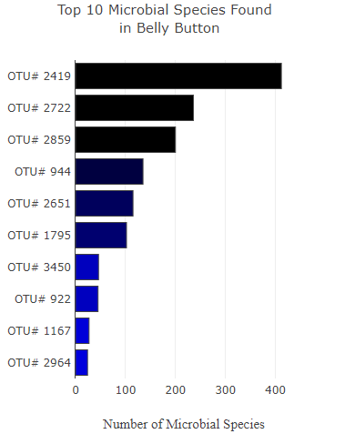
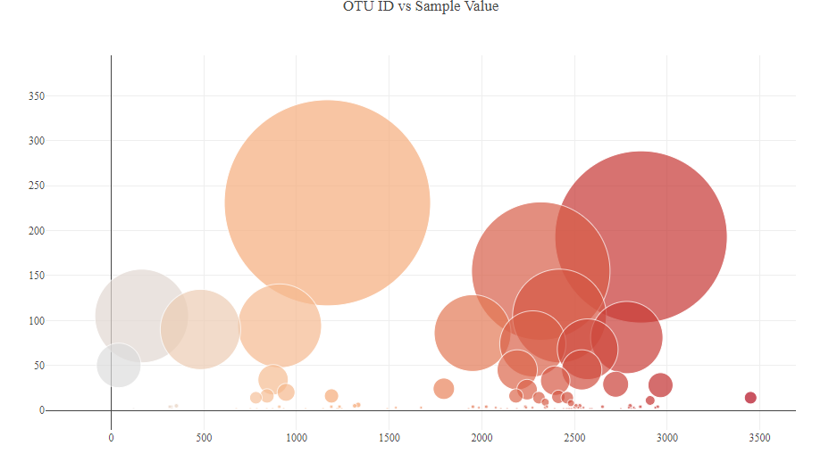
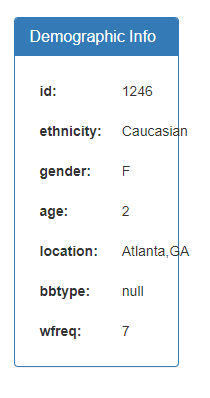

# belly-button-challenge

## Instructions

* Use the D3 library to read in samples.json from the URL (https://2u-data-curriculum-team.s3.amazonaws.com/dataviz-classroom/v1.1/14-Interactive-Web-Visualizations/02-Homework/samples.json).

* Create a horizontal bar chart with a dropdown menu to display the top 10 OTUs found in that individual.

* Create a bubble chart that displays each sample.

* Display the sample metadata, i.e., an individual's demographic information.

* Update all the plots when a new sample is selected.

  `To explore the interactive dashboard please visit` [Deployed Page at GitHub Pages](https://crebello711.github.io/belly-button-challenge/)
